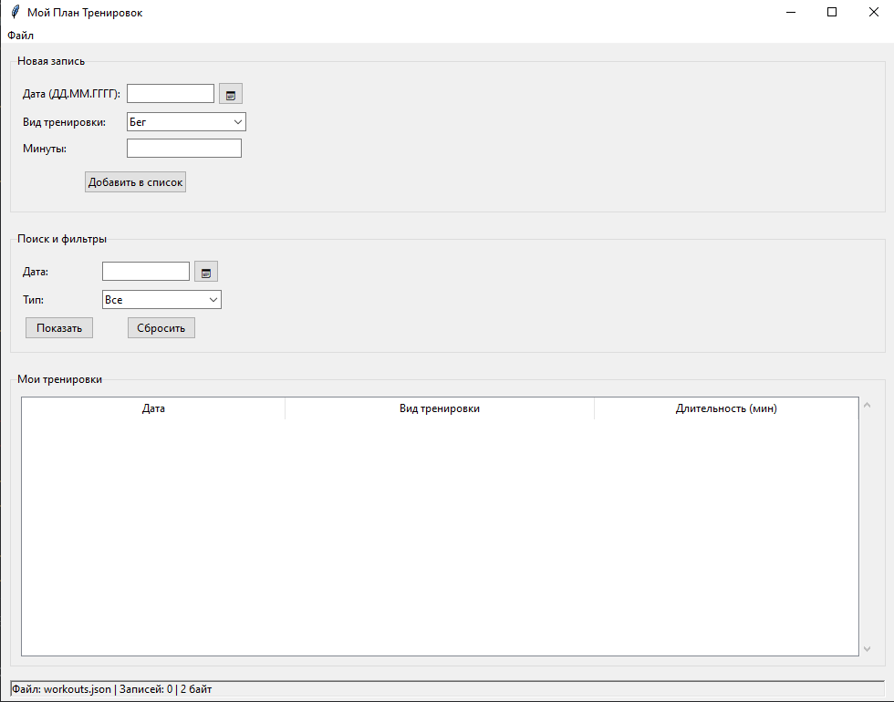
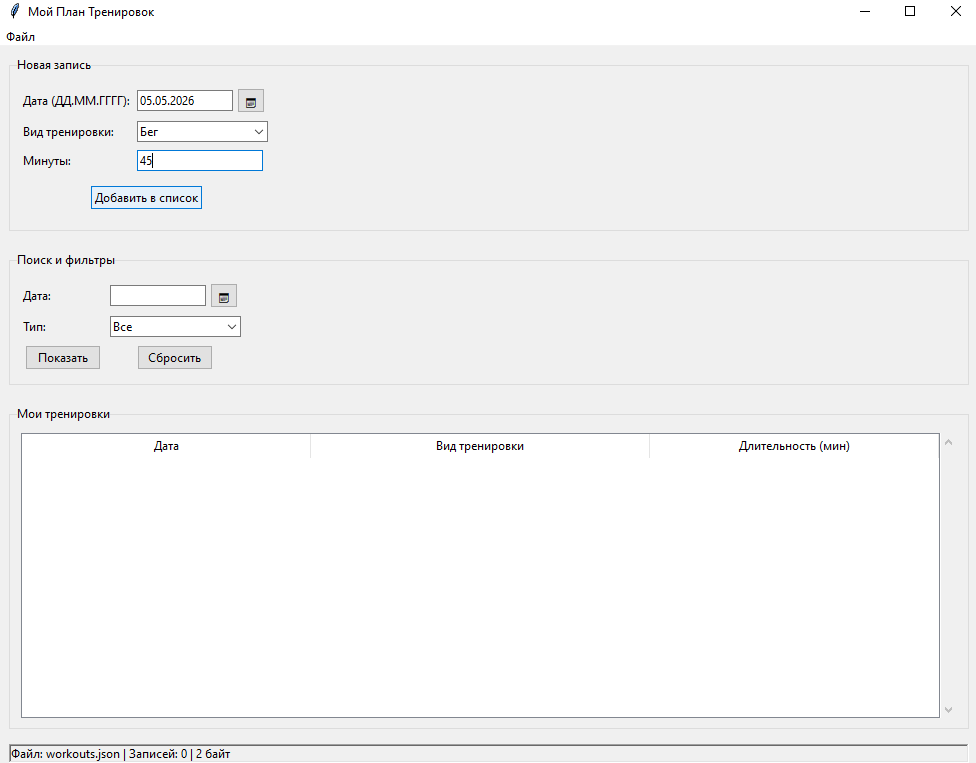
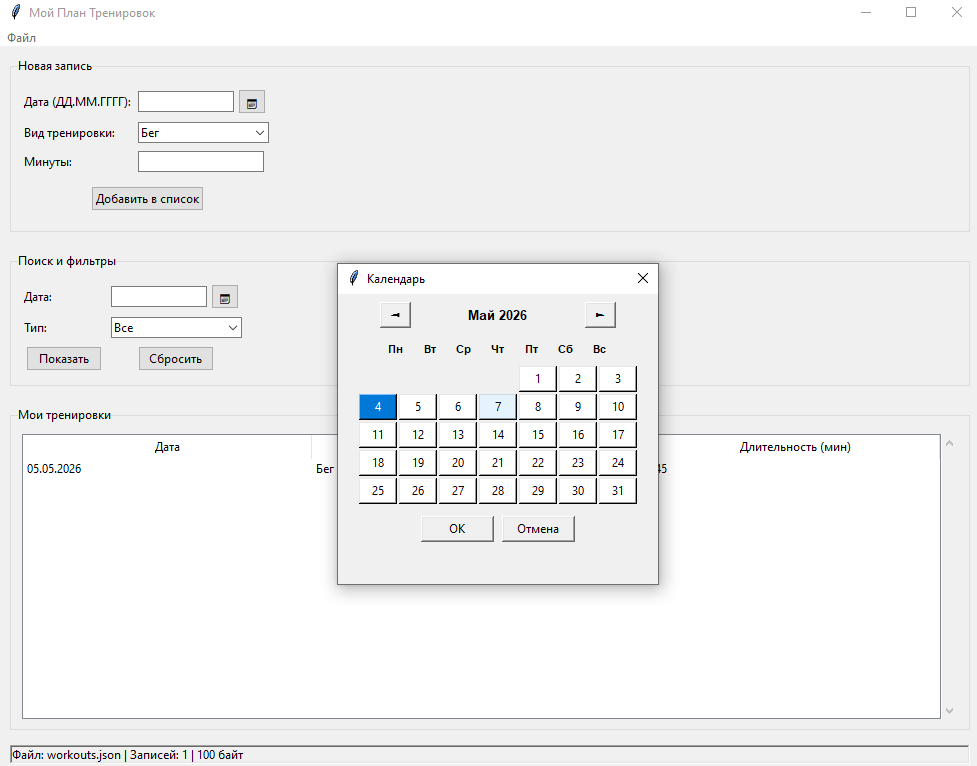
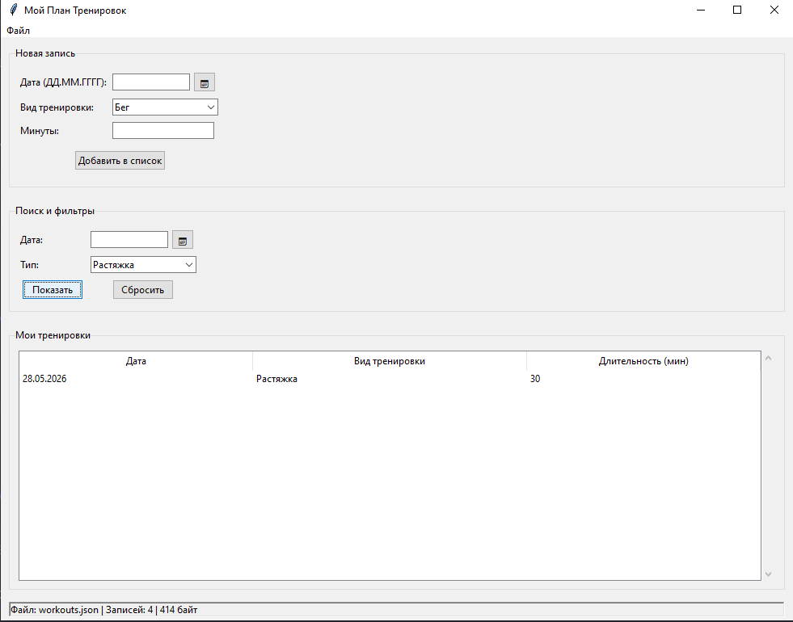
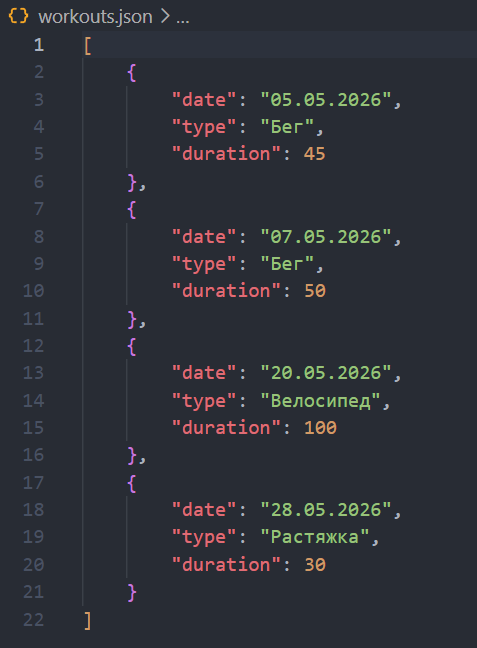
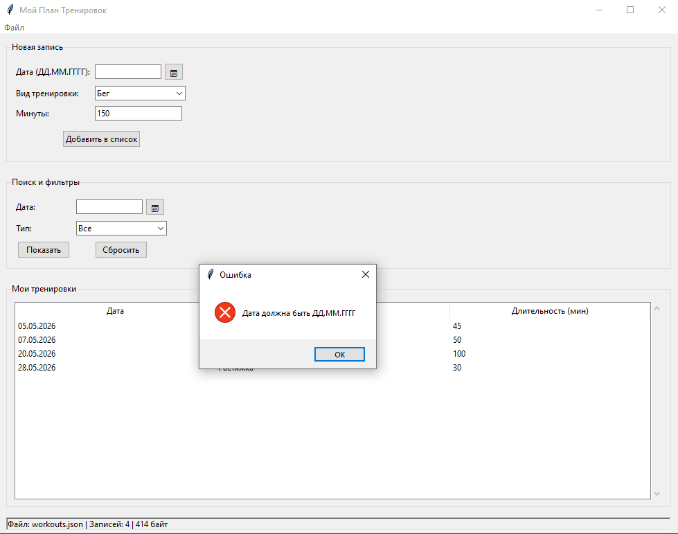

# 🏃 Training Planner

**Разработчик:** Алиева Асия Исламовна

**Версия:** 1.0

## О проекте

Десктопное приложение для ведения личного дневника тренировок. Позволяет записывать занятия, просматривать историю, отфильтровывать нужные записи и хранить всё в удобном формате JSON. Интерфейс построен на стандартной библиотеке Tkinter — никаких дополнительных установок не требуется.

### Что умеет программа

- ✏️ Добавлять тренировку с датой, видом активности и продолжительностью
- 📅 Выбирать дату через встроенный календарь или вводить вручную (точки расставляются автоматически)
- 📋 Отображать все записи в виде таблицы
- 🔎 Фильтровать список по дате, по типу тренировки или одновременно по обоим параметрам
- 🗑️ Удалять ненужные строки через правый клик мыши
- 💾 Сохранять всё в JSON-файл и загружать обратно
- 📤 Экспортировать данные с дополнительной статистикой
- 📥 Импортировать записи из другого JSON-файла (с выбором: заменить или добавить)
- ✅ Проверять правильность введённых данных и сообщать об ошибках

## 📸 Скриншоты

### Главное окно приложения

*Основной интерфейс с таблицей тренировок, формой добавления и фильтрами*

### Добавление тренировки

*Пример заполнения формы: дата через календарь, выбор типа тренировки*

### Календарь для выбора даты

*Встроенный календарь для удобного выбора даты*

### Фильтрация записей

*Применение фильтра по типу тренировки "Растяжка"*

### Работа с JSON

*Структура сохраняемых данных в JSON формате*

### Сообщения об ошибках

*Пример сообщения при некорректном вводе данных*

## 🔧 Запуск

### Что нужно

- Python версии **3.6** или новее
- Никаких сторонних библиотек — только стандартные модули Python

### Как запустить

Скопируйте репозиторий и перейдите в папку проекта:

```bash
git clone https://github.com/asiaIslamovna/training_planner.git
cd training_planner